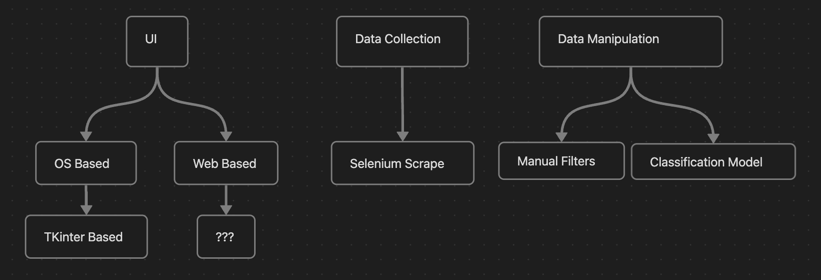

Description:

This is a tool to help monitor and track Online Liquidation Auctions' auctions. The point of this is to add filtering, tracking, and other functionality to make bidding on their auctions a more pleasant experience. 

Design/Elements:

This project incorporates Selenium webscraping, data-manipulation, and inheritance.

Purpose:

Usage Instructions:
